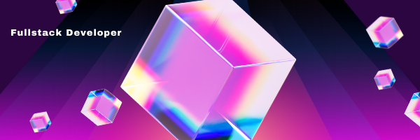

### Hi there 👋, my name is Florian Ginet

####  Full Stack Developer

Who am I? A developer, a passionate person, a perfectionist... who likes to code, to learn, to understand, to exchange, to look for, to convince but also a dad, a gamer who likes challenges, things well done, problems to solve...

### Languages and Tools

 
 
 

- 🔭 I’m currently working on this page. 
- 🌱 I’m currently learning TypeScript -  Vue3- Docker  
- 📫 How to reach me: email 

 
 
 

